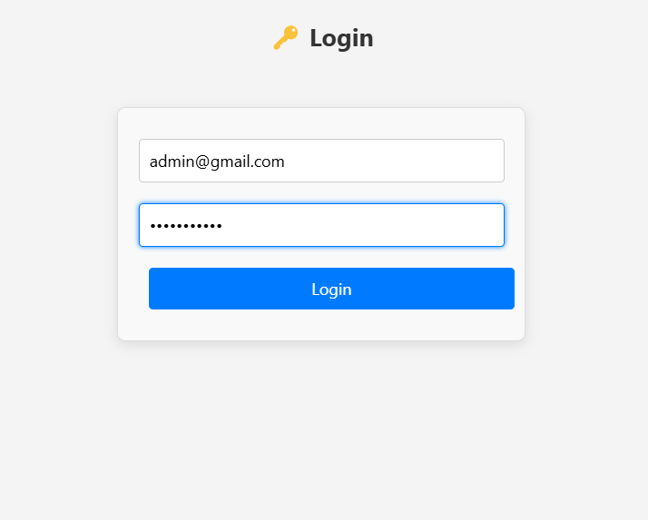
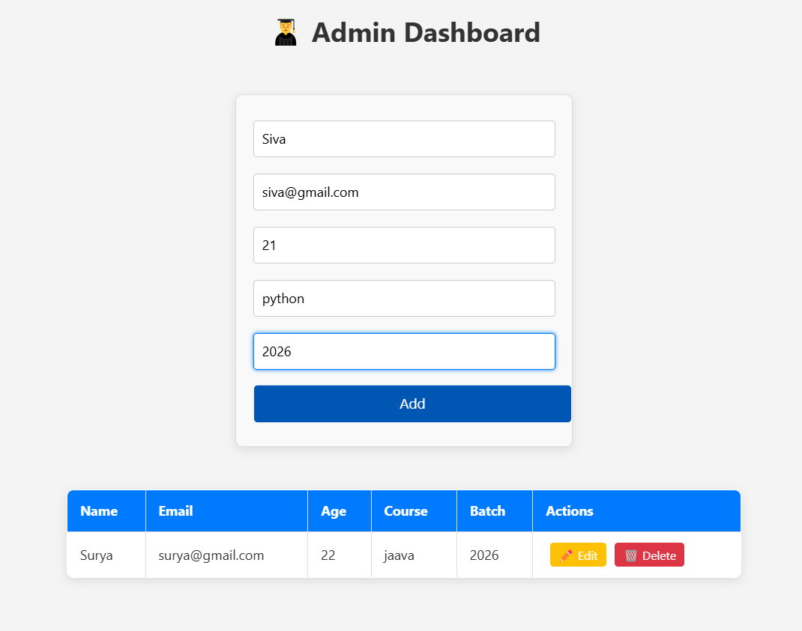
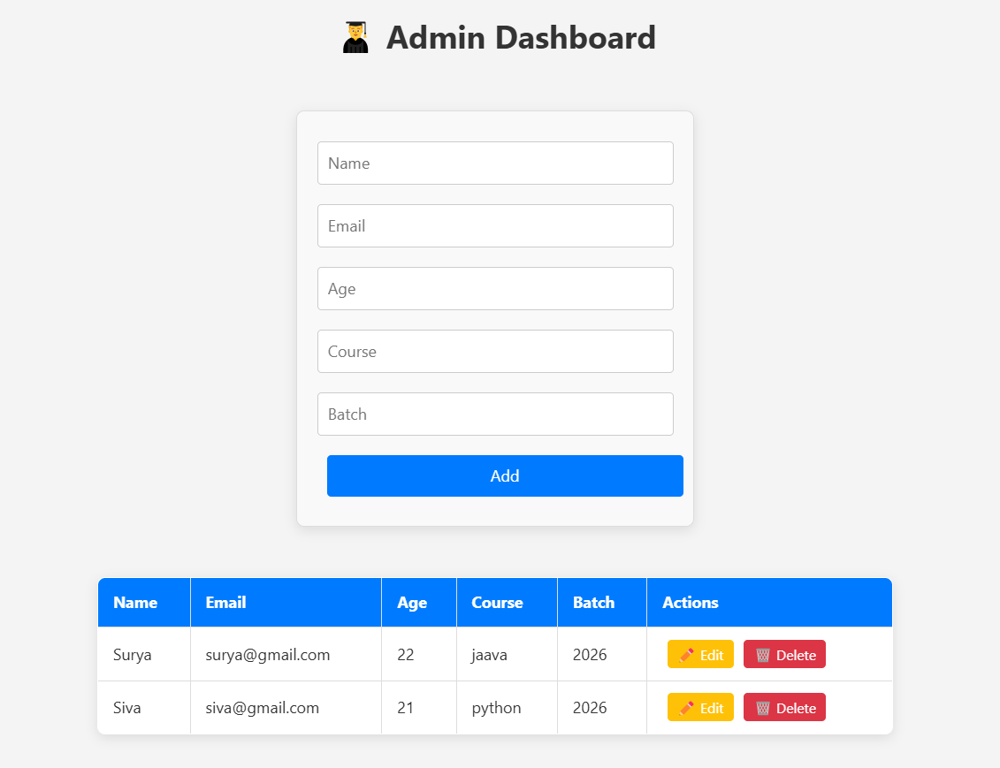
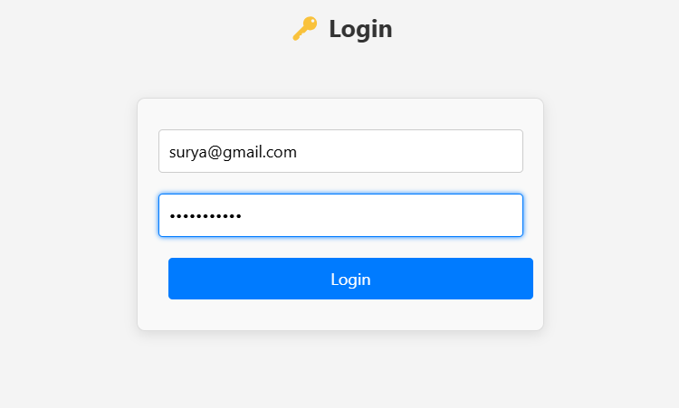
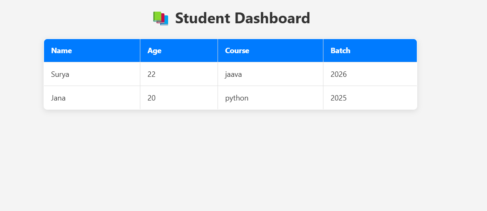
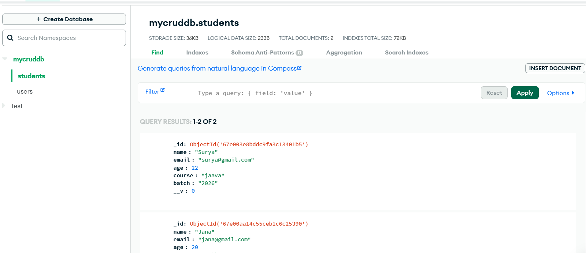

# 🎓 StudentVerse: Student Management System 🚀

> 📚 **Final Project of DevOps Class**  
> 🔥 Integrated with DevOps Practices  

StudentVerse is a full-stack web application for seamless student record management. It features user authentication, CRUD operations, and a responsive design. This project integrates **DevOps practices** for CI/CD, code versioning, and automated deployments.  

---

## 🌟 Features  
✅ **User Authentication:** Secure login with JWT authentication.  
✅ **CRUD Operations:** Create, read, update, and delete student records.  
✅ **Responsive Design:** Mobile-friendly and adaptive UI.  
✅ **DevOps Integration:**  
- Automated builds and deployment pipelines.  
- Version control using Git and GitHub.  
- Containerization with Docker (optional future implementation).  
- CI/CD workflows with GitHub Actions (if applicable).  

---

## 🛠️ Tech Stack  
- **Frontend:** React.js with Tailwind CSS  
- **Backend:** Node.js with Express.js  
- **Database:** MongoDB  
- **Authentication:** JWT (JSON Web Token)  
- **DevOps Tools:** Git, GitHub, CI/CD pipelines  

---

## 🚀 Installation  

### 1️⃣ **Clone the repository:**  
```bash
git clone https://github.com/Surya-2k4/StudentVerse.git
cd StudentVerse
```

### 2️⃣ **Install dependencies:**  
```bash
# Backend
cd server  
npm install  

# Frontend  
cd client  
npm install  
```

### 3️⃣ **Run the application:**  
```bash
# Backend (inside server folder)
 npx nodemon server.js  

# Frontend (inside client folder)
npm start  
```
## 📸 **Screenshots**

## 📸 **Screenshots**

<table>
  <tr>
    <td></td>
    <td></td>
  </tr>
  <tr>
    <td align="center"><b>Admin Login</b></td>
    <td align="center"><b>Admin Dashboard</b></td>
  </tr>
  <tr>
    <td></td>
    <td></td>
  </tr>
  <tr>
    <td align="center"><b>After Adding Student</b></td>
    <td align="center"><b>Student Login</b></td>
  </tr>
  <tr>
    <td colspan="2" align="center">
      
      
    </td>
  </tr>
  <tr>
    <td colspan="2" align="center"><b>Database</b></td>
  </tr>
</table>


---

## 🔥 DevOps Integration Process  
- **Version Control:** Git and GitHub for code management.  
- **CI/CD Pipelines:** Automating build, test, and deploy cycles.  
- **Docker:** Containerization to ensure consistent deployment (optional future implementation).  
- **Monitoring:** Logs and performance metrics (future scope).  

---

## 💡 Author  
👤 **Surya**  
🔗 [GitHub Profile](https://github.com/Surya-2k4)  

